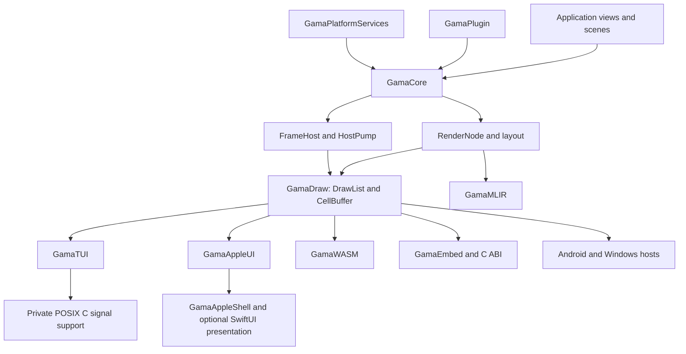

# Gama modernization and refactoring master plan

**Status:** Proposed execution plan  
**Date:** 2026-08-27  
**Audience:** Gama maintainers and reviewers  
**Planning snapshot:** `main` at `4b7986d` when synthesis began; `origin/main` at `e35b3c2`  
**Supersedes:** the execution order in `2026-08-27-gama-next-roadmap.md` where the live tree has already implemented or invalidated a task. Existing architecture decisions and accepted feature scope remain authoritative.

## Executive decision

Modernize Gama as a sequence of small, reversible migrations. Do not rewrite the framework, raise its tools version, introduce a general runtime dependency into `GamaCore`, or change public ownership merely because the pinned compiler supports newer syntax.

The correct order is:

1. Repair known scheduling, signal-safety, unbounded-allocation, documentation, CI, and boundary-check defects.
2. Adopt strict memory safety and explicit import visibility one target at a time, using compiler output as the work queue.
3. Split the largest mixed-responsibility files and test suites without changing public behavior.
4. Establish repeatable performance baselines; optimize only measured bottlenecks.
5. Project existing core semantics into native accessibility and Apple presentation layers.
6. Harden the cross-platform, ABI, packaging, documentation, and formatting surfaces.

Each pull request must leave the tree independently usable and independently revertible. Public API, binary layout, C/WASM symbols, Embedded viability, and backend behavior are constraints, not cleanup opportunities.

## Scope

This plan covers:

- `GamaCore`, `GamaDraw`, `GamaPlugin`, `GamaPlatformServices`, and macros.
- terminal, Apple, SwiftUI-facing, WASM, C embedding, Android, Windows, Embedded, and MLIR surfaces.
- demos, test organization, shell/JavaScript/Python support scripts, CI, documentation, and evidence reporting.
- language-mode modernization supported by the pinned Swift 6.5-dev snapshot while retaining `swift-tools-version: 6.4`.

It does not add unrelated product features. Plugin process isolation, dynamic loading, remote distribution, a new renderer, a new layout model, Qt integration, and a general reactive runtime require separate designs.

## Live-state rule

The repository changed while this plan was researched. At the start of every execution slice:

1. Use the canonical checkout on `main`.
2. Confirm a clean worktree and record `HEAD`, `origin/main`, active worktrees, and relevant open integration branches.
3. Remove tasks already landed and re-run characterization against the actual code.
4. Preserve every unrelated worktree and user change.
5. Do not begin a new structural slice while an overlapping integration branch is still active.

The planning snapshot is evidence of what was inspected, not authority to overwrite newer work.

## Non-negotiable invariants

### Architecture

- `GamaCore` remains stdlib-only and contains no global mutable registries.
- Views compile to `RenderNode`; layout and paint semantics remain shared by every backend.
- Each `FrameHost` owns focus, actions, subscriptions, dirty state, and frame production.
- `HostPump` owns common advance semantics. A backend may schedule and present; it may not fork application semantics.
- Platform layers translate events and present `DrawList` or its target representation.
- `GamaPlatformServices` contains explicit capability boundaries, not implicit platform reach-through.
- C and WASM exports stay versioned and separately namespaced.
- Tests use Swift Testing only.

### Compatibility and evidence

- Preserve `Package.resolved`, the pinned snapshot, Embedded support, and the 6.4 package tools version.
- Do not weaken a cross-platform gate to obtain a green matrix.
- Report local proof, hosted proof, manual proof, provisional behavior, and blockers separately.
- Treat public Swift API, C headers/symbols, WASM exports, serialized DrawList form, and macro expansion as compatibility surfaces.
- Use `swiftly run swift` for ad-hoc work and an external scratch path for tests.

## Target architecture

The modernization does not change this direction of dependency. The new C signal-support target is private implementation support for `GamaTUI`; it does not become a semantic layer or a public package product.

## Migration policy

Choose the least disruptive strategy that can prove the desired property:

| Situation | Strategy | Required proof |
|---|---|---|
| Local bug with stable interface | Direct replacement | Characterization test fails before and passes after |
| Unsafe representation with broad compatibility risk | Parallel implementation behind an internal seam | Parity, size, Embedded, and performance evidence before cutover |
| Large mixed-responsibility file | Mechanical extraction | No public API or behavior delta; full target tests |
| Public ownership/API experiment | Opt-in prototype or benchmark branch | API diff, client migration sample, measured benefit |
| Backend capability | Strangler projection from shared semantic data | Core remains platform-neutral; backend tests and manual proof |
| Formatting/style migration | Dedicated mechanical change | No semantic changes; clean diff and full compile |

## Priority risk register

| Priority | Gap | Failure mode | Resolution wave |
|---|---|---|---|
| P0 | Apple follow-up recursively invokes the frame driver | Sustained invalidation can exhaust the stack or monopolize the main thread | 1A |
| P0 | Runtime loop blocks before draining follow-up work | Required follow-up rendering can be delayed by the event timeout | 1A |
| P0 | Terminal signal handler enters Swift runtime/global state | Undefined or deadlocked behavior in asynchronous signal context | 1B |
| P1 | Terminal rescue does not restore prior dispositions | Gama permanently changes the embedding process's signal behavior | 1B |
| P1 | Progress text derives allocation directly from hostile width | Integer trap or memory exhaustion before layout clips | 1C |
| P1 | Android emulator job omits KVM enablement | Hosted boots fall back to very slow or timing-sensitive emulation | 1E |
| P1 | Portable boundary gate checks imports, not link symbols | Stdlib-only source can silently acquire a runtime/libm dependency | 1F |
| P1 | Strict-memory warnings concentrate at raw-pointer boundaries | Unsafe assumptions remain implicit and can spread | 2 |
| P1 | Future import mode breaks public dependency exposure | Swift 7 mode migration becomes a broad last-minute failure | 2 |
| P2 | Signal docs overclaim retroactive-conformance prevention | Consumers receive a false safety guarantee and a broken ADR link | 1D |
| P2 | Large source and test files combine unrelated responsibilities | Review cost, ownership ambiguity, and regression surface rise | 3 |
| P2 | Apple accessibility semantics are not projected natively | Keyboard/pointer rendering exists without a usable assistive interface | 5 |
| P2 | Performance/ownership proposals lack repeatable measurements | Public complexity may be added without a material benefit | 4 |
| P3 | Default formatter produces thousands of mismatched findings | Style cannot become a meaningful gate until policy is explicit | 7 |

## Wave 0 — integration freeze and baseline

### Goal

Create an authoritative starting point and prevent already-landed or concurrent work from being duplicated.

### Actions

1. Record branch, `HEAD`, upstream, active worktrees, and residual diff.
2. Reconcile every task below against current `main` and the project ledger.
3. Run the baseline gates with `TOOLCHAINS` unset:
   - `./scripts/check-toolchain-pins.sh`
   - `./scripts/check-boundaries.sh`
   - `./scripts/check-apple.sh`
   - `./scripts/check-docs.sh`
   - `./scripts/check-doc-coverage.sh`
4. Record externally unavailable gates rather than pretending they passed.
5. Save public API, exported C/WASM symbols, representative render output, package dump, code size, and timing baselines.

### Exit criteria

- The tree is clean and all overlapping work is accounted for.
- Baseline failures are classified as pre-existing, environment-blocked, or introduced.
- The first implementation PR names its characterization test and rollback point.

## Wave 1 — correctness and safety defects

Wave 1 should be several narrow PRs. Do not bundle these changes merely because they share the word “safety.”

### 1A. Coalesced follow-up scheduling

**Problem.** `GamaHostView` recursively re-enters its driver when a frame requests follow-up. `AppRuntime` may enter `nextEvent(timeoutMillis:)` before servicing the same condition.

**Design.** Define one contract: follow-up work is drained without recursive stack growth and before an idle/blocking event wait. Apple schedules at most one next-run-loop callback. Synchronous runtimes iteratively drain a bounded burst, then yield according to an explicit fairness rule.

**Likely files.** `Sources/GamaCore/HostPump.swift`, `Sources/GamaCore/Runtime.swift`, `Sources/GamaAppleUI/GamaHostView.swift`, `Tests/gamaTests/HostPumpTests.swift`, `Tests/gamaTests/RuntimeLoopTests.swift`, `Tests/gamaTests/AppleHostTests.swift`.

**Characterization.** Inject a scheduler/driver and prove that thousands of consecutive follow-ups keep constant stack depth, coalesce callbacks, do not call `nextEvent` prematurely, and still present every required semantic frame.

**Rollback.** The scheduler seam remains internal. Revert the implementation without changing public APIs.

**Done when.** Core, runtime, and Apple tests cover idle, event-driven, invalidated-during-render, and sustained-follow-up cases; Apple checks are green.

### 1B. Async-signal-safe terminal rescue

**Problem.** The current handler reaches Swift lazy/static storage and buffer APIs in signal context, and disarm leaves replacement dispositions installed. POSIX permits only async-signal-safe operations in this context; `sigaction` can preserve the previous disposition. [signal-safety(7)](https://man7.org/linux/man-pages/man7/signal-safety.7.html), [sigaction(2)](https://man7.org/linux/man-pages/man2/sigaction.2.html)

**Design.** Add a private C target containing plain fixed storage, saved `termios`, saved `sigaction` records, a `volatile sig_atomic_t` armed flag, and the minimal handler. Block managed signals while arming or disarming. Restore each previous disposition during disarm. Swift owns only lifecycle calls outside signal context.

**Likely files.** `Package.swift`, a new private C-support directory, `Sources/GamaTUI/TerminalRescue.swift`, `Sources/GamaTUI/Terminal.swift`, `Tests/gamaTests/TerminalRescueTests.swift`, `Tests/gamaTests/POSIXTerminalIntegrationTests.swift`.

**Characterization.** Use a forked child and PTY. Verify terminal restoration for normal exit and each managed signal, correct signal re-raise/exit behavior, previous-handler restoration, repeated arm/disarm, and no process-global change before activation. Avoid testing the handler through in-process assertions.

**Rollback.** Keep the existing Swift lifecycle API; the implementation target is replaceable behind it.

**Done when.** POSIX integration tests pass on macOS and Linux, strict-memory warnings disappear from the Swift rescue implementation, and a host-installed handler is demonstrably restored.

### 1C. Bounded progress rendering

**Problem.** `ProgressView.bar` multiplies `width` by eight and eagerly allocates generated text. Extreme widths can trap or exhaust memory before clipping.

**Design.** First characterize visible-cell requirements and backend clipping. Define a documented maximum generated-text policy derived from an actual renderer or frame-size limit. Use overflow-checked arithmetic and generate only the required representation. Do not add an unexplained magic cap.

**Likely files.** `Sources/GamaCore/Primitives.swift`, `Sources/GamaCore/TextLayout.swift`, `Tests/gamaTests/ProgressViewTests.swift`.

**Characterization.** Include zero, negative if representable through configuration, ordinary, `Int.max`, and large-but-valid widths. Prove stable visible output and bounded work.

**Done when.** No hostile width traps or triggers proportional unbounded allocation, and normal rendering remains byte-for-byte equivalent.

### 1D. Correct Signal confinement documentation

**Problem.** The source documentation says the unavailable `Sendable` conformance stops retroactive conformance, while ADR 0009 correctly records that it produces a warning rather than making conformance impossible. The source links the wrong ADR filename.

**Design.** Make source docs, ADR index, confinement fixtures, and migration guidance say exactly what the compiler proves. Preserve the negative fixtures.

**Likely files.** `Sources/GamaCore/State.swift`, `docs/adr/0009-signal-is-not-sendable.md`, related DocC pages only if they repeat the claim.

**Done when.** Documentation claims match the diagnostic evidence and every local link resolves.

### 1E. Make Android emulator acceleration explicit

**Problem.** Hosted evidence records a KVM permission failure and long TCG boots, while the workflow does not run the action maintainer's Linux KVM setup. The recommended runner setup creates a udev rule before emulator execution. [Android Emulator Runner](https://github.com/ReactiveCircus/android-emulator-runner)

**Design.** Add the documented KVM-enablement step immediately before the emulator action. Keep readiness diagnostics. After hosted KVM proof, reduce inflated timeout/retry budgets from fresh measured boot distributions rather than guessing.

**Likely files.** `.github/workflows/ci.yml`, `scripts/check-android-emulator.sh`, `scripts/test-android-emulator-readiness.sh`, `tasks/todo.md` when hosted evidence is available.

**Done when.** A hosted run records usable `/dev/kvm`, the emulator boots within the new measured budget, readiness unit tests pass, and the ledger links the run.

### 1F. Prove the portable link boundary

**Problem.** Source import checks cannot catch compiler-emitted or transitive link dependencies such as `libm` symbols.

**Design.** Keep fast source-boundary checks, then add a minimal static/link or undefined-symbol assertion for Linux, WASM, and Embedded artifacts. Maintain a reviewed allowlist per target only where the platform ABI requires it.

**Likely files.** `scripts/check-boundaries.sh`, `scripts/check-linux.sh`, `scripts/check-wasm.sh`, `scripts/check-embedded.sh`, and a small fixture if needed.

**Done when.** A deliberate forbidden symbol makes the gate fail, normal artifacts pass, and the diagnostic names the symbol and target.

### 1G. Remove the macro API deprecation

Replace the deprecated `AttributeListSyntax` construction in `Sources/GamaMacrosImpl/Plugin.swift` with the pinned snapshot's supported API. Keep this a small direct change and verify expansion diagnostics and generated source.

## Wave 2 — compiler-driven language safety

Swift strict memory safety is opt-in and identifies unsafe declarations, conformances, and expressions. Use its annotation vocabulary to narrow irreducible boundaries, not silence entire modules. [SE-0458](https://github.com/swiftlang/swift-evolution/blob/main/proposals/0458-strict-memory-safety.md)

Import access control makes dependency exposure explicit; future language modes make internal the default. Public imports are required only where public signatures expose dependency declarations. [SE-0409](https://github.com/swiftlang/swift-evolution/blob/main/proposals/0409-access-level-on-imports.md)

### 2A. Replace unsafe `ScenePayload` storage in parallel

Prototype a safe type-erasure representation beside the current raw-pointer implementation. Candidate designs may use a private box with a sendable value plus type identity, equality, and hashing operations, but no design is accepted until Embedded compilation, object-size, equality semantics, allocation count, and scene tests are measured.

Cut over only after parity. If existential or allocation cost is unacceptable for Embedded, document the constraint and retain a narrowly annotated implementation with explicit invariants and destructive-copy tests.

### 2B. Narrow irreducible ABI and SDK unsafety

Classify every strict-memory warning:

- C entry points and raw storage in `GamaEmbed` validate nullability, length, alignment, lifetime, and ownership at the boundary.
- Android/JNI and C-return pointers receive the same explicit contracts.
- deliberate leak-control code marks the exact intentional unsafe operation.
- `getenv` and SDK `unowned(unsafe)` properties use the narrowest documented expression or a safer wrapper where available.
- declarations are marked safe only when their implementation fully enforces the invariant.

Do not use file-wide `@unsafe`, unchecked `Sendable`, or broad compiler suppression.

### 2C. Enable strict memory safety target by target

Suggested order:

1. `GamaCore` after `ScenePayload` resolution.
2. `GamaDraw`, `GamaPlugin`, `GamaPlatformServices`, and macros.
3. `GamaTUI` after the C signal shim.
4. Apple, WASM, MLIR, demos, and executables.
5. C embedding and Android last, because unsafe interoperability is intrinsic.

Add the flag per target while migration is active. Promote the repository gate only when every warning is resolved or tied to a reviewed narrow boundary.

### 2D. Adopt explicit import visibility

Run the compiler with `InternalImportsByDefault` one module at a time. Classify imports from the declarations actually exposed:

- `public import` only if a public declaration exposes the dependency's type or the umbrella intentionally re-exports it.
- `package`, `internal`, `fileprivate`, or `private import` at the narrowest accurate level elsewhere.
- keep the umbrella's intentional re-export explicit rather than relying on a future default.

The first known failure is `GamaMLIR/Lowering.swift`, whose public APIs expose `GamaCore` types. Add compile fixtures for intended public imports and accidental leakage. After every module is clean, enable the upcoming feature across the package.

### 2E. Evaluate, do not assume, new concurrency defaults

Assess `NonisolatedNonsendingByDefault`, isolated conformance inference, and related Swift 7 behavior through compiler probes and client fixtures. Gama has limited async production code, and changing public isolation can be source-breaking. Adopt only features that clarify true semantics without forcing global actors or runtime dependencies into portable core.

### Wave 2 exit criteria

- Pinned compiler builds with strict memory safety and explicit import visibility without unexplained diagnostics.
- Every remaining unsafe edge has a nearby invariant, negative test, and owning module.
- Embedded, C ABI, WASM, Apple, and Linux evidence remains distinct and green where runnable.
- Public API and symbol diffs are reviewed explicitly.

## Wave 3 — structural refactoring

Perform mechanical extraction before internal redesign. A move-only PR must not also rename public API, change access, alter algorithms, or reformat the repository.

### 3A. Split the monolithic test suite

Move suites currently concentrated in `Tests/gamaTests/gamaTests.swift` into files named for their responsibility: geometry/style, layout, builder/view, signal/state, actions, CellBuffer, MLIR, run iteration, DrawList, CellPainter, and FrameHost. Preserve every test name, suite attribute, trait, expected diagnostic, and total test count.

This is the lowest-risk structural slice and gives later production splits clear ownership.

### 3B. Split `GamaCore/Primitives.swift`

Proposed internal organization:

- text and text modifiers;
- stack/spacer/divider layout primitives;
- controls (`Button`, `TextField`, `Toggle`);
- collection/progress primitives;
- shared view modifiers and environment transforms.

Keep public names, access, conformances, source locations used by macro diagnostics, and rendered output stable. Do not introduce a new abstraction until extraction tests are green.

### 3C. Split `GamaCore/Scene.swift`

Extract scene identifiers/configuration, the scene protocol and builder, window descriptors/groups, lifecycle/errors, payload/type erasure, window environment, and graph compilation. Keep `ScenePayload` migration separate unless a parallel implementation has already passed Wave 2.

### 3D. Split terminal platform implementations

Separate shared terminal models, POSIX backend, Windows backend, input decoding, raw-mode lifecycle, and rescue lifecycle. The C signal-support target lands before or with the rescue extraction. Public `Terminal` behavior and escape sequences remain stable.

### 3E. Split Apple hosts by responsibility

For `GamaAppleUI`, separate frame scheduling/session state, DrawList presentation, input translation, and accessibility projection. For `GamaAppleShell`, separate shell model/commands, coordinator, logical window identity, and window controller. Preserve one shared event/action path.

### 3F. Split compiler-like modules

- Macros: role entry points, diagnostics, syntax helpers, and plugin registration.
- MLIR: model, validation, escaping/emission, and lowering passes, while retaining one canonical emitter.
- Android scripts: common manifest/toolchain/process helpers with isolated shell tests; do not build a second general script framework.

### Wave 3 exit criteria

- Each mechanical PR has no intentional public API or behavior delta.
- Test count and suite traits are preserved.
- Source files have one clear reason to change and module dependency direction is unchanged.
- `git diff --check`, package build, applicable tests, and public API/symbol comparisons are clean.

## Wave 4 — measured performance and ownership

Apple recommends measuring update and hitch behavior before changing architecture. [Improving app performance](https://developer.apple.com/documentation/Xcode/improving-your-app-s-performance)

### 4A. Add a dependency-free benchmark harness

Create a non-product benchmark executable or script that runs fixed scenarios under the pinned release compiler:

- static and changing text grids at representative terminal sizes;
- sparse and dense `CellBuffer.presentDiff` workloads;
- `DrawList.forEachRun` on homogeneous and highly fragmented rows;
- large view-tree layout and repeated invalidation;
- ScenePayload hashing/equality and graph compilation;
- macro compile-time sample if stable tooling permits.

Record wall time, allocations where available, output bytes, binary size, and peak memory. Use warm-up plus at least five measured runs and publish median and range. Keep raw evidence out of source control unless it is small and stable.

### 4B. Optimize representation only after profiling

Candidate experiments:

- replace repeated `String` concatenation in `CellBuffer.presentDiff` with a capacity-aware UTF-8 builder;
- avoid transient strings in `DrawList.forEachRun` by passing a stable run view or emitting directly;
- batch unchanged regions or partial repaint only if traces show full-frame work dominates;
- cache layout/text results only with explicit invalidation ownership.

Accept a change only if a representative scenario improves materially—use 10% as the default review threshold—without making another supported backend or small case worse beyond noise.

### 4C. Use ownership features surgically

Borrowing/consuming conventions and noncopyable types affect callers and can participate in ABI conventions. [SE-0377](https://github.com/swiftlang/swift-evolution/blob/main/proposals/0377-parameter-ownership-modifiers.md), [SE-0437](https://github.com/swiftlang/swift-evolution/blob/main/proposals/0437-noncopyable-stdlib-primitives.md)

- `Terminal` and private lifecycle tokens are strong candidates after the C rescue work because unique ownership is semantic.
- `CellBuffer` is not a candidate until profiling proves expensive accidental copies and client fixtures show an acceptable migration.
- Public noncopyability requires an API diff, migration guide, copy-failure compile fixture, and all backend builds.
- Prefer internal borrowing/consuming improvements before public signature changes.

### Wave 4 exit criteria

- Baselines are reproducible on a named machine/toolchain.
- Every accepted optimization includes before/after raw numbers and semantic equivalence tests.
- No public ownership change lands on aesthetic grounds.

## Wave 5 — accessibility and Apple presentation

### 5A. Define a platform-neutral accessibility projection

Derive accessibility records from existing `RenderNode`, `DrawList`, focus, actions, labels, values, and interactive regions. A record should contain stable identity, role, label/value/hint, enabled/focused state, bounds, and an existing action identifier. Do not put AppKit/UIKit types in core.

### 5B. Expose native elements

AppKit custom views can expose accessibility children through `NSAccessibilityProtocol`; UIKit containers can own `UIAccessibilityElement` instances. [NSAccessibilityProtocol](https://developer.apple.com/documentation/appkit/nsaccessibilityprotocol), [UIAccessibilityContainer](https://developer.apple.com/documentation/uikit/uiaccessibilitycontainer)

Apple hosts project shared records into native elements, convert bounds correctly, synchronize focus, and route activation through the existing `FrameHost` action path. Backends must not invent independent labels, focus order, or actions.

### 5C. Keep SwiftUI and Liquid Glass presentational

If the accepted roadmap's separate `GamaSwiftUI` target proceeds, it wraps host lifecycle and platform presentation. OS-specific visual effects require availability checks and a tested fallback. They do not enter `GamaCore`, replace retained semantics, or become a prerequisite for non-Apple builds.

### Validation

- unit tests for identity, ordering, role/value projection, focus, stale element removal, and action dispatch;
- macOS and iOS platform tests where APIs permit;
- manual VoiceOver navigation and activation evidence on supported OS versions;
- Instruments traces for repeated updates and accessibility-tree churn.

## Wave 6 — cross-platform and ABI hardening

### C embedding

- centralize pointer validation and error mapping;
- fuzz or property-test hostile lengths, nulls, invalid UTF-8, stale handles, repeated destruction, and namespace/version mismatches;
- compare exported headers and symbols against the accepted baseline;
- keep implementation unsafety behind the narrow C boundary.

### WASM

- eliminate accidental process-global host state or document single-instance constraints explicitly;
- test multiple logical hosts, malformed event payloads, frame serialization, resize, disposal, and browser scheduling;
- preserve separately namespaced/versioned exports and run the real browser smoke.

### Android and Windows

- retain cross-build and packaging checks, JNI boundary tests, emulator readiness diagnostics, and Windows console smoke;
- distinguish cross-compilation from runtime proof;
- keep runner credentials/configuration out of the repository.

### Embedded and MLIR

- run the exact pinned Embedded gate after every core representation or ownership change;
- compare code size and forbidden symbols where relevant;
- keep MLIR lowering deterministic and validate escaping, malformed nodes, and public import exposure.

### Packaging

Treat bundling, signing, notarization, icon production, and hosted distribution as separate evidence layers. Local bundle creation is not notarization or release proof.

## Wave 7 — hygiene, documentation, and enforcement

### Formatting

Do not apply the default formatter blindly: its policy currently disagrees with the repository in thousands of places and includes intentional C ABI spelling.

1. Adopt a reviewed `.swift-format` configuration matching the project's intended indentation and naming policy.
2. Exclude or explicitly configure generated/ABI/negative-fixture cases.
3. Apply formatting in a dedicated mechanical PR.
4. Build and test the exact formatted tree.
5. Enable strict lint only after the baseline is clean.

### Documentation and ADRs

- update claims in the same PR as behavior;
- add ADRs for the C signal boundary, strict-memory policy, and accessibility projection if those designs are accepted;
- keep capability tables separated into implemented, locally proven, hosted proven, provisional, and blocked;
- maintain local link and public-symbol documentation coverage.

### Enforcement

Once migration debt reaches zero, make the compiler flags, boundary checks, API/symbol diffs, formatter, and shell/action lint mandatory. A gate should be strict only after the repository itself satisfies the policy.

## Planned PR sequence

The identifiers describe order, not branch names. Independent slices at the same level may proceed in parallel only when they do not touch the same files or invariants.

| Order | Slice | Dependency |
|---|---|---|
| 0 | Re-snapshot and baseline evidence | None |
| 1 | Runtime/Apple follow-up scheduling | 0 |
| 2 | POSIX C signal rescue and disposition restoration | 0 |
| 3 | Bounded progress rendering | 0 |
| 4 | Signal documentation/ADR correction | 0 |
| 5 | Android KVM and hosted timing | 0; hosted runner |
| 6 | Portable link/symbol boundary gate | 0 |
| 7 | Macro deprecation update | 0 |
| 8 | Mechanical test-suite extraction | 1–4 stable |
| 9 | Safe ScenePayload prototype and parity decision | 8 |
| 10 | Strict memory safety in core/draw/plugin/platform/macros | 2, 7, 9 |
| 11 | Strict memory safety at platform/ABI boundaries | 10 |
| 12 | Explicit import visibility by module | 10; may start earlier if non-overlapping |
| 13 | Primitive and scene source extraction | 8, 9 |
| 14 | Terminal and Apple source extraction | 1, 2, 8 |
| 15 | Macro, MLIR, and Android-script extraction | 7, 8, 12 |
| 16 | Benchmark harness and baseline | Stable Waves 1–3 |
| 17 | Measured rendering/ownership optimization | 16 |
| 18 | Accessibility projection and native elements | 1, 14 |
| 19 | SwiftUI/presentation slice | 14, 18; accepted platform design |
| 20 | Cross-platform hostile-input and ABI hardening | 10–15 |
| 21 | Formatting policy and mechanical formatting | Stable source layout |
| 22 | Final enforcement and evidence reconciliation | All accepted slices |

## Validation matrix

| Change surface | Required local gates | Additional proof |
|---|---|---|
| Core semantics/layout/state | `check-apple.sh`, `check-boundaries.sh`, `check-embedded.sh` | Linux/WASM hosted matrix where local SDKs are unavailable |
| Frame scheduling | Core/runtime/Apple unit tests, `check-apple.sh` | manual responsiveness and Instruments for Apple |
| Terminal/POSIX | terminal unit/integration tests, `check-apple.sh`, `check-linux.sh` where available | real PTY + child-signal behavior on macOS and Linux |
| Apple host/shell/accessibility | `check-apple.sh`, `check-apple-platforms.sh` | VoiceOver and Instruments evidence |
| WASM | `check-wasm.sh`, bundle script | real browser runtime smoke |
| C ABI | `check-c-abi.sh`, header/symbol diff | hostile-input sanitizer/fuzz evidence |
| Android | `check-android.sh`, readiness unit tests | hosted KVM emulator runtime proof |
| Windows | cross-build/package gates | hosted Windows executable smoke |
| Embedded | `check-embedded.sh`, boundary/symbol gate | code-size comparison for representation changes |
| MLIR/macros | target tests and `check-mlir.sh` | compile fixtures and deterministic output |
| Scripts/workflows | `bash -n`, `shellcheck`, `actionlint`, isolated script tests | hosted workflow run for provider behavior |
| Docs/plans/ADRs | `check-docs.sh`, `check-doc-coverage.sh` | link and claim review |
| Formatting | formatter lint, build, tests, `git diff --check` | public API/symbol diff confirms no semantic drift |

For a full release candidate, run `./scripts/check.sh` and report every required runtime blocker honestly. A locally unavailable cross-platform gate is not a pass.

## Review checklist for every slice

- Is the pre-change failure or characterization recorded?
- Does the diff have one primary purpose?
- Did public API, C/WASM symbols, serialized output, or macro expansion change?
- Does `GamaCore` remain stdlib-only and free of process-global registries?
- Are unsafe operations narrower and better documented than before?
- Are Embedded and C/WASM constraints proven, not inferred from Apple success?
- Are tests Swift Testing only, with traits and counts preserved after moves?
- Are local, hosted, and manual results labeled separately?
- Is rollback a simple revert or internal seam switch?
- Was the implementation re-based conceptually on the live tree rather than this planning snapshot?

## Rollback policy

- Keep internal seams until the replacement has passed parity and at least one complete acceptance cycle.
- Never remove the old representation in the same commit that introduces an unproven parallel implementation.
- Feature flags are acceptable for internal presentation/optimization experiments, not for duplicating application semantics.
- Revert a slice if it breaks an invariant, adds unexplained unsafe suppression, regresses a supported target, or lacks the evidence its acceptance criteria require.
- If public API must change, publish migration notes and a compatibility period unless a separate approved breaking-release plan says otherwise.

## Deliberately deferred modernization

The following are not approved merely by this plan:

- raising `swift-tools-version` or changing the pinned snapshot;
- adding Foundation, Synchronization, Observation, or a global actor to `GamaCore`;
- making `CellBuffer` or another widely used public value noncopyable without measured need;
- replacing the retained rendering model or adding backend-specific semantic trees;
- adding a benchmark dependency before a dependency-free harness proves insufficient;
- a wholesale async/await rewrite of synchronous host loops;
- process-wide plugin registries or dynamic plugin loading;
- new product features disguised as file cleanup;
- deleting active worktrees, rewriting history, or force-pushing the default branch.

## Program definition of done

The modernization program is complete when:

1. Known scheduling, signal, allocation, documentation, KVM, and link-boundary defects are fixed with characterization tests.
2. Strict memory safety and explicit import visibility are enforced across accepted targets, with narrow reviewed interop exceptions.
3. Major source/test hotspots have clear responsibility without public semantic drift.
4. Performance and ownership changes are supported by reproducible measurements and compatibility evidence.
5. Apple accessibility uses native elements derived from shared Gama semantics and has manual assistive-technology proof.
6. Apple, Linux, WASM, C ABI, Android, Windows, Embedded, MLIR, macro, docs, and packaging evidence is recorded at the correct proof layer.
7. Formatting and documentation gates enforce an agreed clean baseline.
8. The canonical `main` checkout contains all accepted work, is clean, and has no unique implementation stranded in a temporary worktree.

## Plan verification record

The plan itself changes documentation only. On the recorded `4b7986d` snapshot, with the pinned toolchain selected by the repository scripts:

- `./scripts/check-docs.sh` passed, producing all eight DocC archives plus package metadata and claim-honesty checks.
- `./scripts/check-doc-coverage.sh` passed: every public declaration in every Gama module was documented.
- `./scripts/check-boundaries.sh` passed: both Signal confinement negative fixtures, toolchain-pin consistency, and current portable-core/explicit-ownership rules were green.
- `./scripts/check-apple.sh` passed debug build, 199 Swift Testing tests in 44 suites, and release build.
- `git diff --check` was clean for tracked changes; the only repository change was this untracked plan before handoff.

The builds consistently reported the deprecated `AttributeListSyntax` initializer in `Sources/GamaMacrosImpl/Plugin.swift`, corroborating Wave 1G. The test build also reported a non-mutated local variable in `Tests/gamaTests/MacroUsageTests.swift`; that warning is small hygiene work and is not a reason to mix a production change into the macro modernization slice.

These local Apple/documentation results are not hosted Linux, WASM, Android, Windows, Embedded-runtime, accessibility, Instruments, signing, or notarization proof. Those remain the explicit acceptance layers in the validation matrix.

## Authoritative external references

- [SE-0458: Opt-in Strict Memory Safety Checking](https://github.com/swiftlang/swift-evolution/blob/main/proposals/0458-strict-memory-safety.md)
- [SE-0409: Access-level modifiers on import declarations](https://github.com/swiftlang/swift-evolution/blob/main/proposals/0409-access-level-on-imports.md)
- [SE-0377: Borrowing and consuming parameter ownership modifiers](https://github.com/swiftlang/swift-evolution/blob/main/proposals/0377-parameter-ownership-modifiers.md)
- [SE-0437: Noncopyable standard-library primitives](https://github.com/swiftlang/swift-evolution/blob/main/proposals/0437-noncopyable-stdlib-primitives.md)
- [Swift 6 migration strategy](https://www.swift.org/migration/documentation/swift-6-concurrency-migration-guide/migrationstrategy/)
- [Embedded Swift](https://docs.swift.org/embedded/documentation/embedded/)
- [Linux signal-safety(7)](https://man7.org/linux/man-pages/man7/signal-safety.7.html)
- [Linux sigaction(2)](https://man7.org/linux/man-pages/man2/sigaction.2.html)
- [ReactiveCircus Android Emulator Runner](https://github.com/ReactiveCircus/android-emulator-runner)
- [Apple NSAccessibilityProtocol](https://developer.apple.com/documentation/appkit/nsaccessibilityprotocol)
- [Apple UIAccessibilityContainer](https://developer.apple.com/documentation/uikit/uiaccessibilitycontainer)
- [Apple: Improving your app's performance](https://developer.apple.com/documentation/Xcode/improving-your-app-s-performance)
